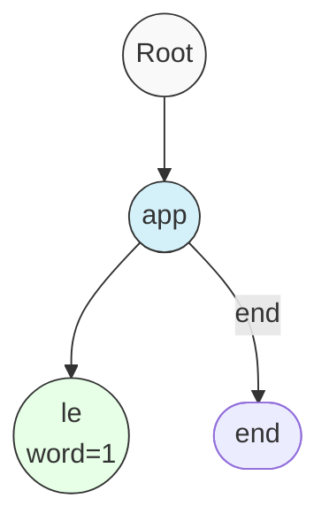

# 🏆 Mastering the Trie - Conclusion and Beyond

Congratulations! You've successfully learned how to implement a Trie data structure with all its core operations. Let's put everything together and explore some advanced concepts and optimizations.

## Complete Trie Implementation 📚

Here's our complete Trie implementation:

```javascript
class TrieNode {
  constructor() {
    this.children = new Map();
    this.wordCount = 0;
    this.prefixCount = 0;
  }
}

class Trie {
  constructor() {
    this.root = new TrieNode();
  }

  insert(word) {
    let node = this.root;
    for (const char of word) {
      if (!node.children.has(char)) {
        node.children.set(char, new TrieNode());
      }
      node = node.children.get(char);
      node.prefixCount++;
    }
    node.wordCount++;
  }

  search(word) {
    let node = this.root;
    for (const char of word) {
      if (!node.children.has(char)) {
        return false;
      }
      node = node.children.get(char);
    }
    return node.wordCount > 0;
  }

  startsWith(prefix) {
    let node = this.root;
    for (const char of prefix) {
      if (!node.children.has(char)) {
        return false;
      }
      node = node.children.get(char);
    }
    return node.prefixCount > 0;
  }

  countWordsEqualTo(word) {
    let node = this.root;
    for (const char of word) {
      if (!node.children.has(char)) {
        return 0;
      }
      node = node.children.get(char);
    }
    return node.wordCount;
  }

  countWordsStartingWith(prefix) {
    let node = this.root;
    for (const char of prefix) {
      if (!node.children.has(char)) {
        return 0;
      }
      node = node.children.get(char);
    }
    return node.prefixCount;
  }

  erase(word) {
    if (!this.search(word)) return;
    let node = this.root;
    for (const char of word) {
      let child = node.children.get(char);
      child.prefixCount--;
      node = child;
    }
    node.wordCount--;
  }
}
```

> [!TIP]
> Notice how we've maintained consistent patterns across all methods, making the code easier to understand and maintain!

## Time and Space Complexity Summary ⏱️

Let's summarize the complexity of our Trie operations:

| Operation | Time Complexity | Space Complexity |
|-----------|-----------------|------------------|
| Insert    | O(m)            | O(m)             |
| Search    | O(m)            | O(1)             |
| StartsWith| O(m)            | O(1)             |
| CountWords| O(m)            | O(1)             |
| Erase     | O(m)            | O(1)             |

Where m is the length of the word/prefix.

## Advanced Trie Optimizations 🚀

While our implementation is solid, there are several optimizations that can make Tries even more efficient for specific use cases:

### 1. Compressed Trie (Radix Tree) 📦



A compressed Trie merges nodes with single children into a single node, saving space. For example, instead of separate nodes for 'a', 'p', 'p', we'd have a single node containing "app".

### 2. Array-Based Children 📊

For alphabets with a fixed, small size (like lowercase English letters), using an array instead of a Map for children can provide faster access:

```javascript
class TrieNode {
  constructor() {
    // For lowercase English letters (26 characters)
    this.children = new Array(26).fill(null);
    this.wordCount = 0;
    this.prefixCount = 0;
  }
}

// Accessing children
const index = char.charCodeAt(0) - 'a'.charCodeAt(0);
```

### 3. Ternary Search Tree 🌲

A Ternary Search Tree is a space-efficient variant where each node has three children: smaller, equal, and larger, making it more memory-efficient for sparse datasets.

### 4. Character-Level Bit Manipulation 🔢

For specialized applications, you can use bit manipulation to represent character transitions, further reducing memory usage.

## Extending the Trie: Advanced Operations 🔍

Beyond our core implementation, you can extend Tries with these powerful operations:

### 1. Finding All Words with a Prefix 📋

```javascript
findAllWithPrefix(prefix) {
  const results = [];
  // Find the node corresponding to the prefix
  let node = this.root;
  
  for (const char of prefix) {
    if (!node.children.has(char)) return results;
    node = node.children.get(char);
  }
  
  // Perform DFS from this node to find all words
  function dfs(currentNode, currentWord) {
    if (currentNode.wordCount > 0) {
      // Add this word to results (potentially multiple times if count > 1)
      for (let i = 0; i < currentNode.wordCount; i++) {
        results.push(currentWord);
      }
    }
    
    // Explore all children
    for (const [char, childNode] of currentNode.children) {
      dfs(childNode, currentWord + char);
    }
  }
  
  dfs(node, prefix);
  return results;
}
```

### 2. Wildcard Pattern Matching 🃏

Extending Tries to support wildcard characters like '?' (match any single character) or '*' (match any sequence) adds powerful pattern matching capabilities.

### 3. Longest Common Prefix 📏

```javascript
longestCommonPrefix() {
  let prefix = "";
  let node = this.root;
  
  // While there's exactly one child and no word ends here
  while (node.children.size === 1 && node.wordCount === 0) {
    const [char, childNode] = node.children.entries().next().value;
    prefix += char;
    node = childNode;
  }
  
  return prefix;
}
```

## Real-World Applications Revisited 🌎

Now that you understand the full power of Tries, let's explore more sophisticated real-world applications:

### 1. Autocomplete with Ranking 🔝

Extend the Trie to store popularity scores with words, enabling ranked autocomplete suggestions:

```javascript
// Modification to TrieNode to include popularity
class TrieNode {
  constructor() {
    this.children = new Map();
    this.wordCount = 0;
    this.prefixCount = 0;
    this.popularity = 0; // Higher means more popular
  }
}
```

### 2. Spell Checker with Error Correction ✅

Implement fuzzy search to find words that are close to a misspelled query:

```javascript
// Pseudo-code for finding words with edit distance <= 1
findSimilarWords(word, maxDistance = 1) {
  // Use techniques like deletion, insertion, substitution
  // to find close matches in the Trie
}
```

### 3. IP Routing in Networks 🌐

Network routers use specialized Tries (Patricia Tries) to efficiently match IP prefixes for routing decisions.

### 4. Genomic Sequence Analysis 🧬

Tries are used to store and efficiently search for patterns in DNA sequences, with specialized encodings for the limited alphabet (A, C, G, T).

## Trie Strengths and Limitations 💪⚠️

### Strengths:
- Extremely fast prefix operations: O(m) where m is string length
- Space-efficient for datasets with common prefixes
- Naturally supports ordered traversal of strings
- Excellent for autocompletion and prefix-based queries

### Limitations:
- Can use more memory than other structures for random strings
- Not ideal for exact string matching of a single string
- Construction time can be significant for large datasets
- Not as cache-friendly as some simpler data structures

## 🧠 Final Challenge: Building an Autocomplete System

As a final challenge, think about how you would design a complete autocomplete system using a Trie:

<details>
<summary>See a possible solution</summary>

1. **Data Structure**: Use a Trie with popularity scores for each word
2. **Data Collection**: Insert words from a corpus, incrementing counts for repeated words
3. **Prefix Matching**: Use `findAllWithPrefix` to get all words with user's input as prefix
4. **Ranking**: Sort results by popularity score
5. **Performance Optimization**: Use a compressed Trie for memory efficiency
6. **User Experience**: Show top N suggestions as user types

```javascript
class AutocompleteSystem {
  constructor(corpus) {
    this.trie = new EnhancedTrie();
    
    // Build the Trie from corpus
    for (const [word, frequency] of corpus) {
      this.trie.insert(word, frequency);
    }
  }
  
  getSuggestions(prefix, limit = 5) {
    const allMatches = this.trie.findAllWithPrefix(prefix);
    
    // Sort by popularity and return top 'limit' results
    return allMatches
      .sort((a, b) => b.popularity - a.popularity)
      .slice(0, limit)
      .map(item => item.word);
  }
}
```

</details>

## Conclusion: The Power of Tries 🎯

You've now mastered the Trie data structure – one of the most elegant and powerful tools in a programmer's toolkit for string-related operations. From the basic structure to advanced variations and applications, you've seen how Tries solve real-world problems efficiently.

Remember these key takeaways:

1. **Prefix Sharing** is what gives Tries their power and efficiency
2. **Time Complexity** for operations depends mainly on word length, not dataset size
3. **Counting** makes our implementation more powerful with minimal overhead
4. **Real-World Applications** are numerous and impactful

As you continue your algorithmic journey, keep Tries in mind whenever you face string-related challenges, especially those involving prefixes and pattern matching. This elegant data structure might just be the perfect solution!

Happy coding! 🚀👨‍💻👩‍💻 