# 🧮 Mathematical Intuition: The Square Root Approach

> [!NOTE]
> This lesson explores the mathematical reasoning behind the optimal solution to the Two Crystal Balls problem.

## 🔍 Finding the Perfect Jump Size

We've seen that:
- Linear search (jump size = 1) is too slow: O(n) drops in worst case
- Binary search doesn't work with only two balls
- We need something in between!

Let's consider using a jump size of k floors with our first ball:
1. We check floors k, 2k, 3k, ... until the ball breaks
2. If it breaks at floor jk, we use the second ball to check floors (j-1)k+1 through jk-1 one by one

### 🤔 Analyzing the Worst Case

In the worst case scenario:
- First ball breaks at the last possible jump point
- Second ball breaks at the last possible floor we need to check

Let's calculate the maximum number of drops needed:

**First ball drops:** ⌈n/k⌉ (ceiling of n divided by k)  
**Second ball drops:** k-1  
**Total drops:** ⌈n/k⌉ + (k-1)

## 🔮 Optimizing the Jump Size

To find the optimal value of k, we need to minimize ⌈n/k⌉ + (k-1).

Let's simplify by approximating ⌈n/k⌉ as n/k:
- Total drops ≈ n/k + k - 1

To find the minimum of this expression, we can use calculus or simply observe that:
- As k increases, n/k decreases
- As k increases, k increases
- These are competing factors!

The minimum occurs when n/k = k, which means:
- k = √n

```mermaid
graph LR
    A[Smaller Jump Size] -->|Increases| B[First Ball Drops]
    A -->|Decreases| C[Second Ball Drops]
    D[Larger Jump Size] -->|Decreases| B
    D -->|Increases| C
    B --> E[Total Drops]
    C --> E
    F[k = √n] -->|Minimizes| E
```

## 🧪 Verifying with Examples

Let's check a few examples:

### Example 1: n = 100 floors
- Optimal jump size: k = √100 = 10
- Worst case: 10 drops with first ball + 9 drops with second ball = 19 drops
- Compare to linear search: 100 drops in worst case

### Example 2: n = 10000 floors
- Optimal jump size: k = √10000 = 100
- Worst case: 100 drops with first ball + 99 drops with second ball = 199 drops
- Compare to linear search: 10000 drops in worst case

> [!TIP]
> This is why the algorithm has O(√n) time complexity - we've reduced the problem from O(n) to O(√n)!

## 🎯 Why This Works

The square root approach works because it:

1. Balances the work done by both balls
2. Minimizes the maximum number of drops needed
3. Creates an optimal trade-off between jump size and linear search range

Deeper Mathematical Insight

The formula n/k + k - 1 reaches its minimum when its derivative with respect to k equals zero:

d/dk (n/k + k - 1) = -n/k² + 1 = 0

Solving for k:
-n/k² + 1 = 0
n/k² = 1
k² = n
k = √n

This confirms mathematically that the optimal jump size is indeed √n.

In the next lesson, we'll translate this mathematical insight into an algorithm and implement the Two Crystal Balls solution! 