# 🌎 Real-World Applications

> [!NOTE]
> While the Two Crystal Balls problem might seem abstract, its principles and approach have surprising applications in the real world. Let's explore some practical scenarios where this algorithm shines!

## 🛡️ Software Testing and Deployment

### Binary Search with Limited Resources

When testing software or deploying releases, the Two Crystal Balls algorithm can help identify the exact point where a bug was introduced:

**Scenario**: You have a continuous integration pipeline with 1000 commits, and you know that somewhere along the line, a bug was introduced. Running a full test suite on each commit is expensive.

**Solution**: 
1. Use the "first ball" (test runs) to check every √1000 ≈ 32 commits
2. When you find a failing test, go back to the last passing commit
3. Check each commit linearly until you find the exact breaking change

```mermaid
flowchart LR
    A[Working Commit] --- B[Working Commit] --- C[Working Commit] --- D[Broken Commit] --- E[Broken Commit]
    
    subgraph "First Ball (Jump by √n)"
        F["Commit √n"] --- G["Commit 2√n"] --- H["Commit 3√n"]
    end
    
    subgraph "Second Ball (Linear)"
        I["Commit 2√n + 1"] --- J["Commit 2√n + 2"] --- K["Commit 2√n + 3"]
    end
```

> [!TIP]
> This approach is similar to git bisect, but with an optimal jumping strategy for limited test resources!

## 🧪 Materials Science and Quality Control

### Finding Breaking Points with Limited Samples

**Scenario**: A materials lab needs to determine the precise temperature at which a new alloy begins to deform. Testing destroys the samples, and only a limited number are available.

**Solution**: Apply the Two Crystal Balls algorithm to efficiently find the critical temperature:
1. Test at temperature increments of √n degrees
2. When deformation occurs, step back and test each degree in the last interval

## 🌐 Network Engineering

### Finding Bandwidth Thresholds

**Scenario**: A network engineer needs to find the exact traffic threshold where a system begins to experience packet loss. Each test disrupts service momentarily.

**Solution**:
1. Test at bandwidth increments of √n Mbps
2. When packet loss occurs, reduce to the previous increment and test linearly

## 💻 Binary Search Debugging

### Finding Minimum Requirements

**Scenario**: A game developer needs to find the minimum RAM requirements for a game to run without crashes. Testing many configurations is time-consuming.

**Solution**:
1. Test at memory increments of √n MB
2. When the game runs stably, move to linear testing in the last interval

## 🐞 Debugging Complex Systems

### Isolating Failure Points in Complex Dependencies

**Scenario**: A microservice application has stopped working, and the issue might be in one of hundreds of dependencies or configurations.

**Solution**:
1. Group dependencies into √n batches
2. Test each batch until finding a problematic one
3. Test each dependency in that batch linearly

## 📊 Data Analysis

### Finding Breakpoints in Time Series Data

**Scenario**: An analyst needs to find exactly when a trend changed in a large dataset with thousands of time points.

**Solution**:
1. Sample the data at intervals of √n time points
2. When a change is detected, examine the previous interval linearly

## 🎓 Education and Learning

### Adaptive Learning Systems

**Scenario**: An educational platform needs to determine a student's proficiency level from a large set of ordered difficulty questions, while minimizing student fatigue.

**Solution**:
1. Present questions at difficulty intervals of √n
2. When the student struggles, step back and find the exact threshold linearly

> [!WARNING]
> Remember that the Two Crystal Balls algorithm works best when:
> 1. The property being tested has a clear threshold
> 2. Testing resources are limited
> 3. The property is monotonic (once true, remains true for all higher values)

## 💭 Something to Think About

How would you modify the algorithm if...

1. You had three crystal balls instead of two? Would the optimal jump size still be √n?

2. The breaking property wasn't strictly monotonic? For example, what if the balls break within a range of floors but survive above and below that range?

3. You wanted to minimize the average number of drops instead of the worst-case number?

These variations lead to fascinating extensions of the original problem!

In the next and final lesson, we'll summarize everything we've learned about the Two Crystal Balls algorithm and provide some challenging exercises to test your understanding. 