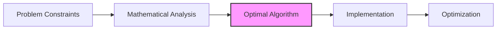

# 🎓 Conclusion: Mastering the Two Crystal Balls Algorithm

> [!NOTE]
> Congratulations on reaching the end of our journey through the Two Crystal Balls algorithm! Let's consolidate what we've learned and test your understanding with some challenging exercises.

## 🔑 Key Takeaways

### The Problem
- Find the exact floor where crystal balls start breaking with only two balls
- Minimize the worst-case number of drops required
- Monotonic property: if a ball breaks at floor X, it will break at all higher floors

### The Solution Strategy
1. Jump by √n floors with the first ball
2. When it breaks, go back to the previous jump point
3. Use the second ball to test each floor in the last section linearly

### Why It Works
- Time Complexity: O(√n), a significant improvement over O(n) linear search
- Space Complexity: O(1)
- Balances the work done by both balls
- Mathematically proven to minimize the worst-case number of drops

### Real-World Applications
- Software testing with limited resources
- Finding thresholds in systems
- Quality control with destructive testing
- Debugging complex dependencies

## 🧠 Mental Model for Algorithm Design

The Two Crystal Balls problem teaches us several valuable lessons about algorithm design:

1. **Constraint Analysis**: The specific constraints (two balls) fundamentally shape the optimal solution.

2. **Mathematical Optimization**: Sometimes, mathematical analysis reveals non-intuitive solutions (like √n jumps).

3. **Beyond Binary/Linear**: There are often efficient algorithms between O(log n) and O(n) complexity.

4. **Resource Management**: Efficiently allocating limited resources is key to optimal solutions.

5. **Worst-Case Optimization**: Sometimes we need to optimize for the worst case rather than the average case.

## 💪 Practice Exercises

### Exercise 1: Implementation in Another Language
Implement the Two Crystal Balls algorithm in a programming language of your choice (Python, Java, C++, etc.).

### Exercise 2: Modified Constraints
How would you solve the problem if:
- You have 3 crystal balls instead of 2?
- You have k crystal balls and n floors?
- The balls have a "durability" factor and can be dropped a certain number of times before breaking?

### Exercise 3: Non-Monotonic Property
Design an algorithm for finding a specific floor where balls break, but the breaking property isn't monotonic (i.e., balls might break at floor X but survive at floor X+1).

### Exercise 4: Minimizing Average Case
Modify the algorithm to minimize the average number of drops rather than the worst-case number.

### Exercise 5: Real-World Application
Describe a real-world scenario not mentioned in our lessons where the Two Crystal Balls algorithm could be applied, and explain how you would implement it.

## 🎯 Final Challenge: Prove It!

Can you mathematically prove that √n is the optimal jump size?

Here's the proof outline:

1. Let k be our jump size
2. Worst-case drops with the first ball: ⌈n/k⌉
3. Worst-case drops with the second ball: k-1
4. Total worst-case drops: ⌈n/k⌉ + (k-1)
5. To minimize this function, we can approximate ⌈n/k⌉ as n/k
6. So, we minimize: n/k + k - 1
7. Taking the derivative and setting it to zero:
   - d/dk (n/k + k - 1) = -n/k² + 1 = 0
   - n/k² = 1
   - k² = n
   - k = √n

Therefore, √n is the optimal jump size that minimizes the worst-case number of drops.

## 🚀 Where to Go From Here

- Study other search algorithms like exponential search, interpolation search, and jump search
- Explore dynamic programming solutions for the generalized k-balls, n-floors problem
- Apply the "batch testing" insight to other resource-constrained problems
- Dive deeper into mathematical optimization for algorithm design

> [!TIP]
> The Two Crystal Balls problem demonstrates that sometimes the most elegant solutions come from careful mathematical analysis rather than purely intuitive approaches. Always question your initial instincts!

Thank you for joining us on this algorithmic journey. Remember that algorithms are tools for solving problems, and selecting the right algorithm for the right context is a crucial skill in software engineering.

Happy coding! 🎉 