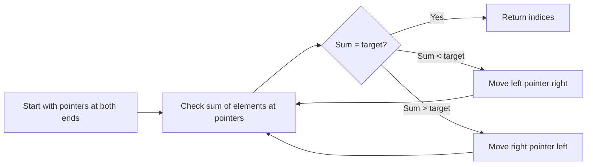

# 🌎 Real-World Applications and Related Algorithms

> [!NOTE]
> In this lesson, we'll explore how the Two Sum problem and its solution approaches apply in real-world scenarios and discuss related algorithms.

## 💼 Practical Applications of the Two Sum Algorithm

The Two Sum problem might seem like a simple coding exercise, but its pattern and solution techniques appear in many real-world applications:

### 1. Financial Analysis and Trading

- **Portfolio Matching**: Finding pairs of investments that together meet a specific return target.
- **Risk Balancing**: Identifying combinations of assets whose risks offset each other.
- **Transaction Matching**: In accounting systems, finding pairs of transactions that balance to a particular amount.

### 2. E-commerce and Retail

- **Product Bundling**: Finding pairs of products whose combined price meets a promotional threshold.
- **Budget Shopping**: Helping customers find combinations of items that fit within their budget constraints.
- **Inventory Management**: Identifying product combinations that together use specific amounts of resources.

### 3. Route Planning and Navigation

- **Travel Planning**: Finding pairs of destinations that can be visited within a specific time or distance constraint.
- **Shipping Optimization**: Identifying pairs of packages that together fill a container optimally.

### 4. Scientific and Research Applications

- **Chemical Compounds**: Finding pairs of elements that together achieve a specific molecular weight.
- **Data Analysis**: Identifying data points whose values together satisfy experimental conditions.
- **Signal Processing**: Finding pairs of signals whose combination produces specific patterns.

## 🧩 Variations of the Two Sum Problem

The Two Sum problem has several important variations that build on the same principles:

### 1. Three Sum Problem

Find three numbers in an array that add up to a specific target value.

```javascript
function threeSum(nums, target) {
  nums.sort((a, b) => a - b); // Sort the array
  
  for (let i = 0; i < nums.length - 2; i++) {
    // Skip duplicates
    if (i > 0 && nums[i] === nums[i-1]) continue;
    
    let left = i + 1;
    let right = nums.length - 1;
    
    while (left < right) {
      const sum = nums[i] + nums[left] + nums[right];
      
      if (sum === target) {
        return [i, left, right];
      } else if (sum < target) {
        left++;
      } else {
        right--;
      }
    }
  }
  
  return undefined;
}
```

### 2. Four Sum Problem

An extension of the Three Sum problem to find four numbers that add up to a target. It typically uses a combination of hashing and the three sum approach.

### 3. Two Sum II - Input Array Is Sorted

A variation where the input array is already sorted.

```javascript
function twoSumSorted(nums, target) {
  let left = 0;
  let right = nums.length - 1;
  
  while (left < right) {
    const sum = nums[left] + nums[right];
    
    if (sum === target) {
      return [left, right];
    } else if (sum < target) {
      left++;
    } else {
      right--;
    }
  }
  
  return undefined;
}
```

### 4. Two Sum - Less Than or Equal to Target

Find all pairs whose sum is less than or equal to the target.

### 5. Two Sum - Closest to Target

Find the pair whose sum is closest to the target value.

## 🔄 Related Patterns and Techniques

The Two Sum problem introduces several important problem-solving patterns:

### 1. The Two-Pointer Technique

For the sorted array variation, the two-pointer technique (using left and right pointers that move toward each other) is a powerful approach:



### 2. Space-Time Trade-offs

The Two Sum problem perfectly illustrates how we can trade space complexity for time complexity:
- Brute force: O(n²) time, O(1) space
- Hash map: O(n) time, O(n) space

### 3. The Complement Pattern

The key insight of looking for complements (target - current) appears in many other problems.

## 🚀 Beyond Two Sum: Extensions and Advanced Topics

### 1. Multiple Pairs

What if we want to find all pairs that sum to the target, not just one?

```javascript
function allTwoSumPairs(nums, target) {
  const numMap = new Map();
  const result = [];
  
  for (let i = 0; i < nums.length; i++) {
    const complement = target - nums[i];
    
    if (numMap.has(complement)) {
      // We could have multiple instances of the complement
      const indices = numMap.get(complement);
      for (const j of indices) {
        result.push([j, i]);
      }
    }
    
    // Add current number to map (with all its indices)
    if (!numMap.has(nums[i])) {
      numMap.set(nums[i], []);
    }
    numMap.get(nums[i]).push(i);
  }
  
  return result;
}
```

### 2. Subarray Sum Equals K

Finding a subarray whose elements sum to a specific value - this uses a similar "running sum and complement" approach.

### 3. Continuous Subarray Sum

Determining if there's a subarray whose sum is a multiple of a given value.

## 💭 Reflection Questions

<details>
<summary>How might you adapt the Two Sum algorithm if you needed to find pairs with a specific difference instead of a specific sum?</summary>

For a "Two Difference" problem (find pairs where a - b = target), we can rewrite it as a + target = b. This means for each element a, we look for a + target in our hash map. The implementation would be very similar to the Two Sum hash map approach!
</details>

<details>
<summary>Can you think of a way to solve the Two Sum problem if the array is too large to fit in memory?</summary>

For extremely large data sets:
1. Split the array into smaller chunks that fit in memory
2. Sort each chunk
3. Use external sorting to merge the chunks
4. Once sorted, use the two-pointer approach
5. Alternatively, use a database with appropriate indexing
</details>

## 🎓 Conclusion on Real-World Applications

The Two Sum problem is more than just a coding interview question—it represents a fundamental pattern in algorithm design and problem-solving. The techniques you've learned here—particularly hash maps for lookup optimization and the two-pointer approach for sorted data—are powerful tools that apply to many practical scenarios.

By understanding these patterns and their applications, you're building a stronger foundation for solving more complex problems in your coding journey!

In the next lesson, we'll conclude our exploration of the Two Sum problem with a comprehensive review and practice exercises. 